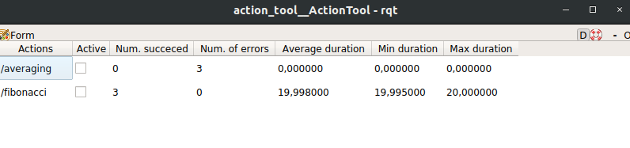

# action_tool

Rqt tool to monitor ros actions.
It registers all actions running after the tool is started and displays the analytics.
Example


## Usage
Build the package using 
```
catkin_make
```
Launch the tool
```
roslaunch action_tool start.launch
```
